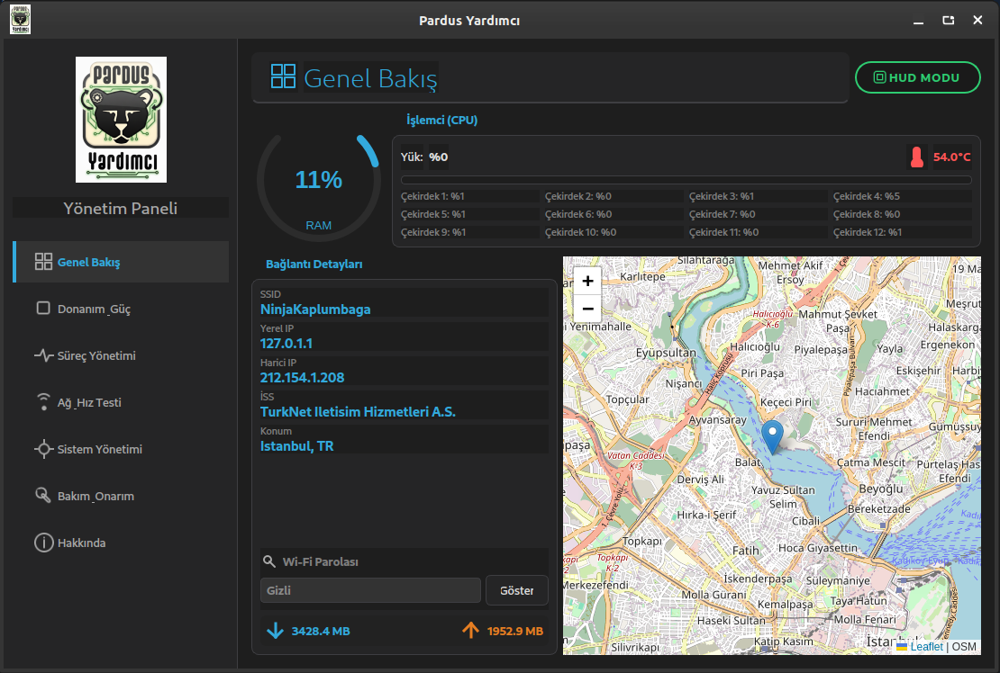
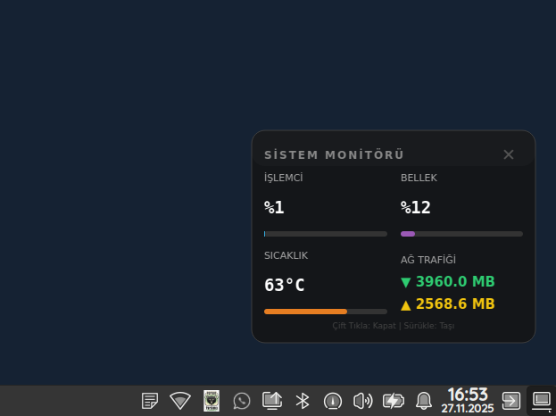
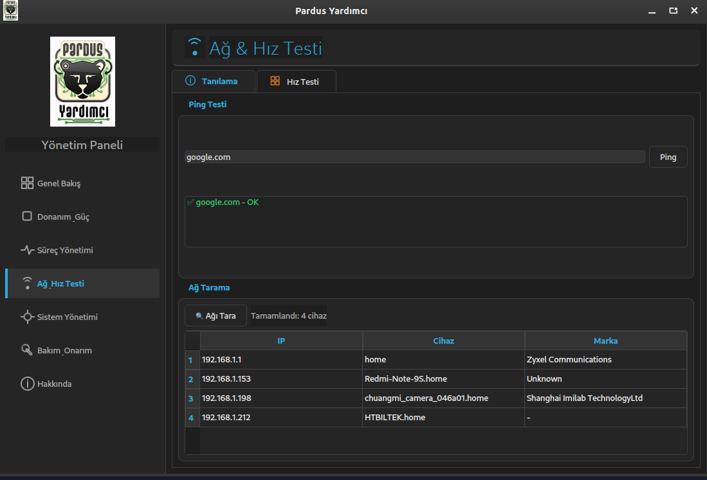
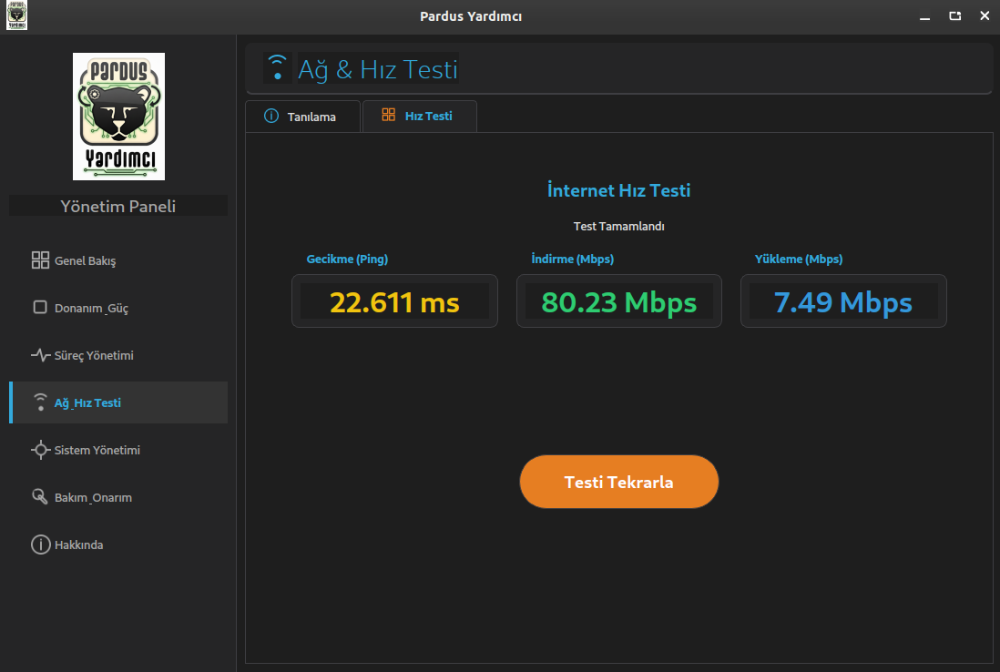
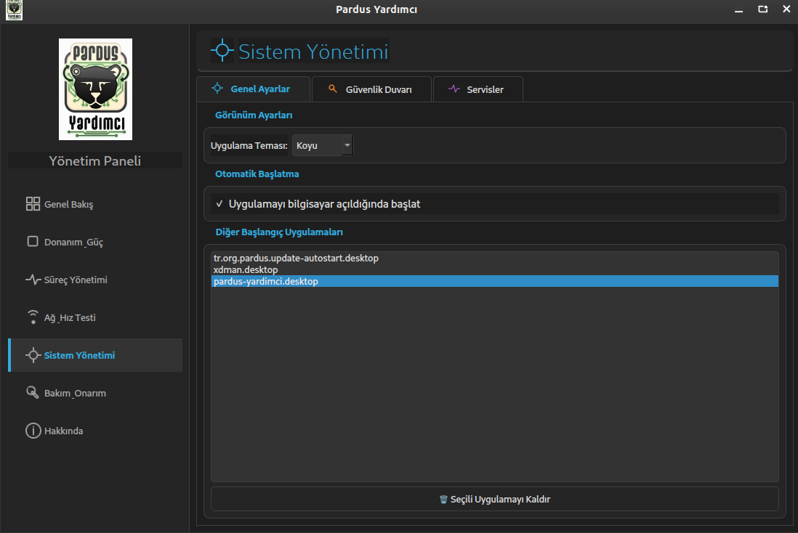
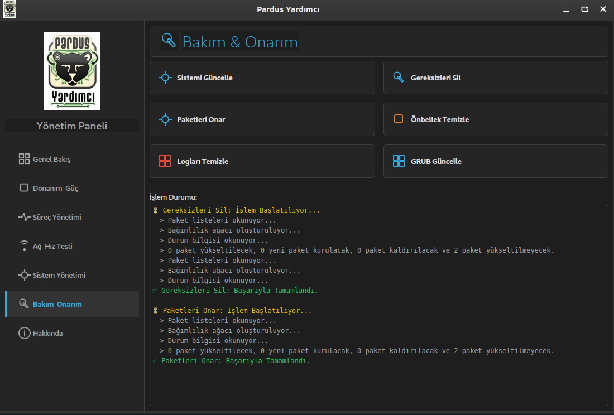
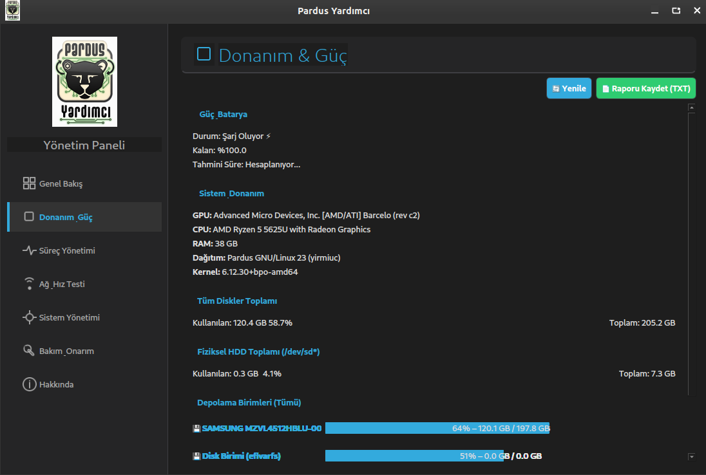

# 🐧 Pardus Yardımcı (Pardus Assistant)


**Pardus Yardımcı**; Pardus ve Debian tabanlı Linux sistemleri için geliştirilmiş, sistem bakımını, yönetimini ve performans takibini kolaylaştıran, açık kaynaklı ve kullanıcı dostu bir masaüstü uygulamasıdır.

Karmaşık terminal komutları yerine, **modern ve anlaşılır bir arayüz** ile sisteminize tam hakimiyet kurmanızı sağlar.



---

## 🚀 Öne Çıkan Özellikler

* **Tüm bağımlılıkları tek pakette toplayarak offline tam kurulum yapabilmekte ve çalışabilmektedir. xfce, gnome, kde gibi popüler masaüstlerinde çalışmaktadır.**

### 📊 1. Genel Bakış & Dashboard
* **Anlık İzleme:** CPU, RAM, Swap ve Disk kullanım oranlarını grafiksel göstergelerle takip edin.
* **Sıcaklık Takibi:** İşlemci sıcaklığını anlık görüntüleyin.
* **Ağ Durumu:** Wi-Fi SSID, Yerel/Harici IP, İSS ve anlık veri akış hızı (Download/Upload).
* **Harita Entegrasyonu:** IP tabanlı tahmini konum gösterimi.

### 🖥️ 2. HUD Modu (Heads-Up Display)
* **Matrix Temalı Mini Ekran:** Ekranın köşesinde, dikkatinizi dağıtmadan çalışan, şeffaf ve minimalist sistem monitörü.
* **Her Zaman Üstte:** Diğer pencerelerin üzerinde kalarak sistem durumunu sürekli göz önünde tutar.



---

### 🚀 3. Profesyonel Hız Testi
* **Multi-Thread Performans:** Cloudflare altyapısını kullanarak 4 farklı kanaldan (multi-thread) eş zamanlı test yapar.
* **Yüksek Doğruluk:** Ping (Gecikme), Jitter, Download ve Upload hızlarını en yakın sunucudan otomatik ölçer.





---

### 🛡️ 4. Sistem ve Güvenlik Yönetimi
* **Güvenlik Duvarı (UFW):** Grafik arayüz ile güvenlik duvarını açıp kapatın, kuralları listeleyin.
* **Servis Yönetimi:** Arka planda çalışan kritik servisleri (Systemd) görün ve gerekirse durdurun.
* **Başlangıç Uygulamaları:** Bilgisayar açılışında otomatik başlayan programları yönetin.
* **Wi-Fi Şifre Kurtarma:** Kayıtlı ağların şifrelerini tek tıkla görüntüleyin.




---

### 🛠️ 5. Bakım ve Onarım
* **Tek Tıkla Temizlik:** `apt` önbelleğini, gereksiz paketleri ve eski yapılandırma dosyalarını temizler.
* **Sistem Güncelleme:** Sistemi en güncel haline getirir.
* **Paket Onarımı:** Bozuk paket bağımlılıklarını (`fix-broken`) otomatik onarır.



---

### 💾 6. Gelişmiş Donanım Analizi
* **Akıllı Disk Algılama:** Fiziksel (HDD/SSD) ve Sanal (Loop/Ram) diskleri ayırt eder, doluluk oranlarını raporlar.
* **Batarya Sağlığı:** Laptop kullanıcıları için batarya sağlığı, şarj durumu ve kalan süre tahmini.
* **Donanım Detayları:** CPU Modeli, GPU (Ekran Kartı), Kernel sürümü ve Dağıtım bilgileri.



---

## 💻 Kullanılan Teknolojiler

Bu proje, performans ve kararlılık için aşağıdaki teknolojiler kullanılarak geliştirilmiştir:

| Teknoloji | Açıklama |
| :--- | :--- |
| **Python 3** | Ana programlama dili. |
| **PyQt6** | Modern ve duyarlı Grafik Kullanıcı Arayüzü (GUI). |
| **QtWebEngine** | Harita ve web tabanlı içeriklerin render edilmesi. |
| **Multithreading** | Arayüz donmalarını önlemek ve eş zamanlı işlemler (Hız testi vb.) için. |
| **Subprocess & Pkexec** | Güvenli Linux sistem komutları ve yetki yönetimi. |
| **Psutil** | Sistem kaynakları ve donanım bilgisi toplama kütüphanesi. |
| **Requests** | API haberleşmeleri ve ağ işlemleri. |

---

## 📦 Kurulum

### Yöntem 1: .DEB Paketi ile Kurulum (Önerilen)
Son kullanıcılar için en kolay yöntemdir.

1. **[Sürümler (Releases)](https://github.com/tvardar/pardus-yardimci/releases)** sayfasından en son `.deb` dosyasını indirin.

2. İndirdiğiniz dosyaya **çift tıklayarak** veya terminalden aşağıdaki komutla kurun:

```bash
sudo dpkg -i pardus-yardimci_1.0_amd64.deb
sudo apt-get install -f  # Eksik bağımlılık varsa tamamlar
```
---

### Yöntem 2: Kaynak Koddan Derleme (Yazılım geliştiriciler)

#### 1. Depoyu klonlayın
git clone [https://github.com/tvardar/pardus-yardimci.git](https://github.com/tvardar/pardus-yardimci.git)
cd pardus-yardimci

#### 2. Gerekli kütüphaneleri yükleyin
pip install -r requirements.txt

#### 3. Uygulamayı başlatın
python3 yardimci_app.py


### 🤝 Katkıda Bulunma

Projeye katkıda bulunmak isterseniz memnuniyet duyarız!

Bu depoyu Fork edin.

Yeni bir özellik dalı (branch) oluşturun (git checkout -b yeni-ozellik).

Değişikliklerinizi yapın ve Commit edin (git commit -m 'Yeni özellik eklendi').

Dalınızı Push edin (git push origin yeni-ozellik).

Bir Pull Request oluşturun.
