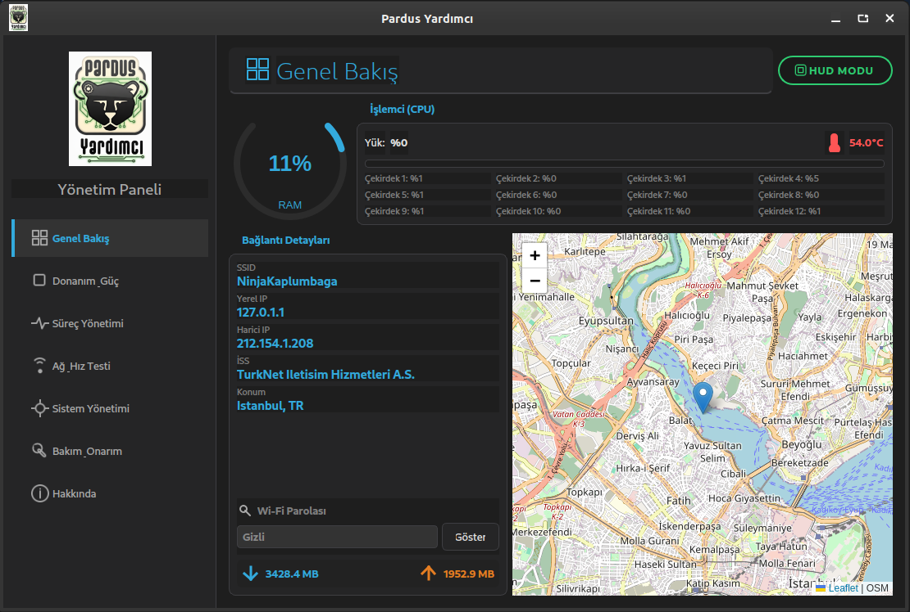

# Pardus Yardımcı v1.0 🇹🇷

**Pardus Yardımcı**, Pardus ve Debian tabanlı Linux dağıtımları için geliştirilmiş; sistem izleme, bakım, ağ yönetimi ve donanım takibi işlemlerini tek bir modern arayüzde toplayan açık kaynaklı bir araçtır.


*(Buraya programın ekran görüntüsünü ekleyebilirsiniz)*

## 🚀 Özellikler

* **Genel Bakış:** Anlık CPU, RAM, Disk kullanımı, Sıcaklık takibi ve Ağ trafiği.
* **Ağ & Hız Testi:**
    * İndirme (Download), Yükleme (Upload) hız testi.
    * Ping ve Gecikme ölçümü.
    * Ağ cihazlarını tarama (Marka/Model tespiti).
    * Wi-Fi şifresini görüntüleme.
* **Donanım & Güç:**
    * Batarya sağlığı, şarj durumu ve tahmini süre.
    * İşlemci, Ekran Kartı (GPU), RAM ve Disk detayları.
* **Sistem Yönetimi:**
    * Güvenlik Duvarı (UFW) kontrolü (Aç/Kapa/Kural Listeleme).
    * Başlangıç uygulamalarını yönetme.
    * Kritik servisleri (Systemd) durdurma/izleme.
* **Bakım & Onarım:** Tek tıkla sistem güncelleme, gereksiz dosya temizliği, paket onarımı.
* **Görev Yöneticisi:** Çalışan süreçleri izleme ve sonlandırma (Kill).
* **Sistem Tepsisi:** Arka planda çalışabilme.

## 📦 Kurulum ve Çalıştırma

Bu program **Taşınabilir (Portable)** yapıdadır. İnternet bağlantısı olmadan da `bagimliliklar` klasörü sayesinde kurulabilir.

### Gereksinimler
* Pardus 23 veya üzeri (Debian 12 tabanlılar)
* Python 3.11+
* `nmcli`, `pkexec` (Genelde yüklü gelir)

### 1. İndirme
Depoyu klonlayın veya ZIP olarak indirin:
```bash
git clone [https://github.com/tvardar/pardus-yardimci.git](https://github.com/tvardar/pardus-yardimci.git)
cd pardus-yardimci